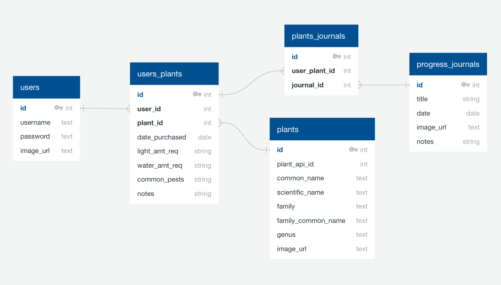

# Brown Thumb API

A web application that help plant lovers with a brown thumb to access a resource that helps them keep track and better care for their plants. This API store the database of users, plants and journals.

## External API 

This external API provides the plants data needed for the Brown Thumb project. 
https://trefle.io/

## API Documentation

View Brown Thumb API documentation here: 
https://brown-thumb-api.herokuapp.com/swagger/

## Database Schema 

